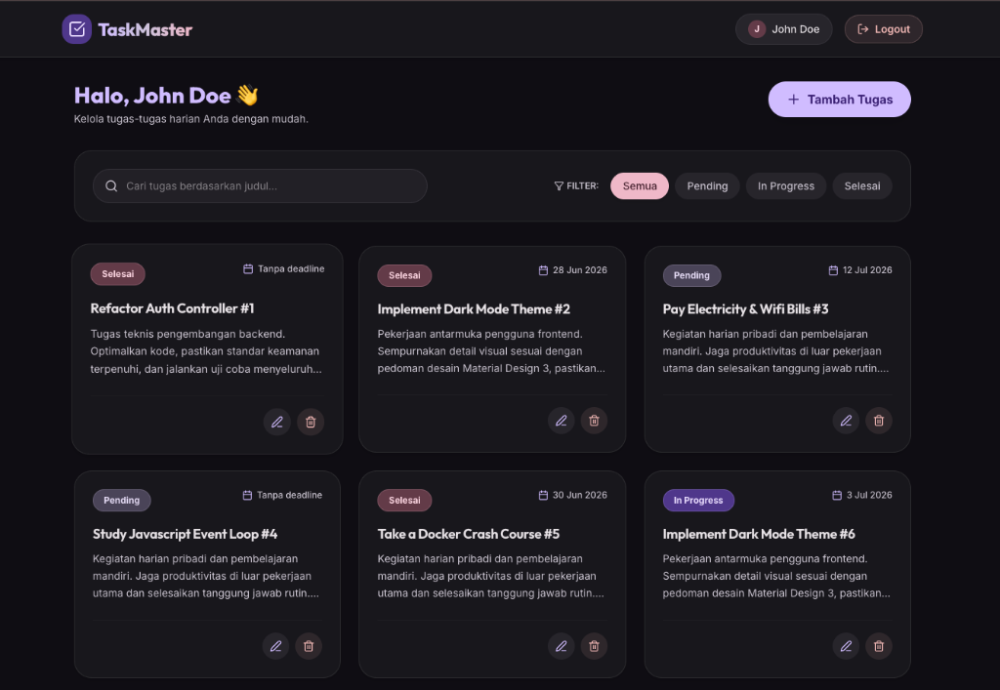

# Task Management System

Aplikasi Task Management System sederhana yang dibangun menggunakan **Express.js, React.js (Vite), dan MySQL**. Aplikasi ini didesain menggunakan **Material Design 3 Expressive Theme** untuk memberikan antarmuka pengguna yang premium, modern, dan sangat responsif.



---

## Fitur Utama (MVP & Nilai Plus)
1. **Autentikasi Pengguna**:
   - Register akun baru dengan validasi regex email.
   - Login dengan pengembalian token JWT.
   - Logout (menghapus token di sisi client).
   - Route Protection: Halaman utama hanya dapat diakses setelah login.
2. **Manajemen Tugas (CRUD)**:
   - Membuat tugas baru dengan *Title*, *Description*, *Status*, dan *Deadline* (dengan validasi format tanggal di backend).
   - Menampilkan daftar tugas milik masing-masing user.
   - Memperbarui tugas (edit judul, deskripsi, status, deadline).
   - Menghapus tugas dengan konfirmasi dialog.
3. **Filter & Live Search**:
   - Menyaring tugas berdasarkan status (`Pending`, `In Progress`, `Selesai`).
   - Pencarian tugas real-time (live search) berdasarkan judul dengan *debounce* 300ms.
4. **Infinite Scroll (Nilai Plus)**:
   - Memuat data secara otomatis (*fetch-on-scroll*) dengan batasan 6 data per halaman untuk performa optimal.
5. **Indikator Tenggat Terlewat (Overdue Indicator - UX)**:
   - Menyorot tenggat waktu dengan warna merah dan memberikan badge kedip **"Terlewat"** jika tugas belum selesai dan tanggal deadline sudah lewat dari hari ini.
6. **Docker Support (Nilai Plus)**:
   - Dijalankan dalam container Docker menggunakan Docker Compose.
7. **Unit Testing (Nilai Plus)**:
   - Pengujian terintegrasi menggunakan **Vitest** dan **Supertest** untuk memastikan keandalan rute API.
8. **Dokumentasi API (Nilai Plus)**:
   - Menyertakan berkas Postman Collection yang komprehensif.

---

## Desain Antarmuka (Material Design 3 Expressive)
- **Tema Visual**: Sleek Dark Mode menggunakan palet warna kontras tinggi M3.
- **Bentuk (Shapes)**: Sudut melengkung yang menonjol (`rounded-3xl` / 24px) untuk kartu, tombol pill, dan dialog modal.
- **Mikro-Animasi**: Efek hover interaktif, active scaling (ripple-like), dan overlay modal transparan dengan blur (`backdrop-blur`).

---

## Panduan Instalasi & Jalankan Lokal

### 1. Prasyarat
- Node.js (versi 22 (LTS) atau lebih baru)
- MySQL Database

### 2. Setup Database
1. Buka MySQL client Anda (PhpMyAdmin, Laragon, DBeaver, dll.).
2. Buat database baru bernama `task_manager`.
3. Import berkas `backend/schema.sql` untuk menginisialisasi tabel `users` dan `tasks` (skema sudah teroptimasi dengan indeks komposit).

### 3. Setup Backend
1. Buka terminal di folder `backend/`.
2. Duplikat file `.env.example` menjadi `.env`:
   ```bash
   cp .env.example .env
   ```
3. Sesuaikan konfigurasi database Anda di dalam file `.env`:
   ```env
   PORT=5000
   DB_HOST=localhost
   DB_USER=root
   DB_PASSWORD=
   DB_NAME=task_manager
   JWT_SECRET=your_jwt_secret_key_here
   ```
4. Install dependensi:
   ```bash
   npm install
   ```
5. **Populasi Database (Database Seeder)** (Sangat Direkomendasikan):
   Jalankan perintah berikut untuk mengisi database dengan **2 akun default** yang masing-masing memiliki **50 data tugas acak**:
   ```bash
   npm run seed
   ```
   * **Akun John Doe**: `john@example.com` (password: `secretpassword`)
   * **Akun Jane Doe**: `jane@example.com` (password: `secretpassword`)
6. Jalankan server backend (development mode):
   ```bash
   npm run dev
   ```
   *Server backend akan berjalan di `http://localhost:5000`.*

### 4. Setup Frontend
1. Buka terminal baru di folder `frontend/`.
2. Duplikat file `.env.example` menjadi `.env`:
   ```bash
   cp .env.example .env
   ```
3. Install dependensi:
   ```bash
   npm install
   ```
4. Jalankan aplikasi frontend:
   ```bash
   npm run dev
   ```
   *Aplikasi frontend akan berjalan di `http://localhost:5173` atau port yang tertera pada terminal.*

---

## Unit Testing (Uji Coba API)
Anda dapat menjalankan rangkaian pengujian otomatis untuk menguji keandalan rute autentikasi dan kesehatan endpoint API:
1. Buka terminal di folder `backend/`.
2. Jalankan perintah berikut:
   ```bash
   npm run test
   ```
   *Pengujian menggunakan framework **Vitest** dan **Supertest**.*

---

## Dokumentasi API (Postman Collection)
Untuk menguji endpoint API secara manual menggunakan Postman, silakan import berkas berikut yang berada di direktori utama proyek:
* [postman_collection.json](postman_collection.json)

Koleksi ini mencakup skenario pengujian lengkap untuk status kode:
* **200 & 201**: Skenario sukses login, registrasi, pengambilan, pembaruan, dan penghapusan tugas.
* **400 Bad Request**: Skenario kegagalan validasi form kosong, kesalahan format email, sandi terlalu pendek, atau format tanggal salah.
* **401 Unauthorized**: Skenario pemanggilan rute terproteksi tanpa menyertakan JWT Bearer Token.
* **404 Not Found**: Skenario manipulasi data ID tugas yang tidak ada atau milik user lain.
* **500 Internal Error**: Skenario simulasi gangguan server.

---

## Menjalankan Menggunakan Docker (Rekomendasi - Cukup 1 Klik)

Aplikasi ini sudah mendukung Docker Compose untuk inisialisasi instan tanpa perlu install MySQL atau Node secara lokal.
1. Pastikan **Docker** dan **Docker Compose** telah terinstal di komputer Anda.
2. Jalankan perintah berikut di direktori root project:
   ```bash
   docker-compose up --build
   ```
3. Docker secara otomatis akan:
   - Membuat database MySQL dan mengimport `schema.sql`.
   - Menjalankan server backend Express di `http://localhost:5000`.
   - Menjalankan aplikasi frontend React di `http://localhost:3000`.
